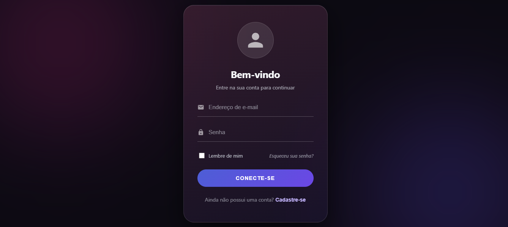
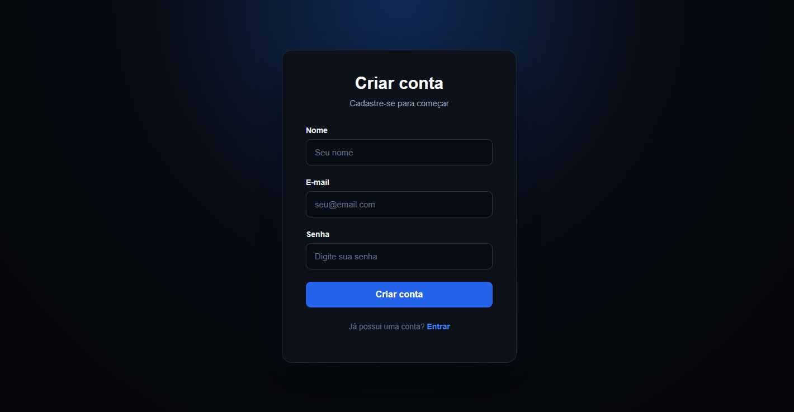

# 🔐 Auth System

Sistema de autenticação Full Stack desenvolvido com **React** no frontend e **Spring Boot** no backend.

O projeto foi desenvolvido para praticar autenticação, segurança de APIs, JWT, integração entre frontend e backend e persistência de usuários em banco de dados.

<p align="left">
  
  
  
  
  
</p>

---

## 🖥️ Demonstração

### 🔑 Tela de Login



### 📝 Tela de Cadastro



### 🏠 Dashboard


---

## 🚀 Tecnologias utilizadas

### Backend

- Java 21
- Spring Boot
- Spring Security
- JWT
- BCrypt
- Spring Data JPA
- Hibernate
- PostgreSQL

### Frontend

- React
- Vite
- Axios
- CSS

---

## 🔐 Funcionalidades

- ✅ Cadastro de usuários
- ✅ Login
- ✅ Autenticação utilizando JWT
- ✅ Criptografia de senhas com BCrypt
- ✅ Rotas protegidas
- ✅ Logout
- ✅ Validação de sessão
- ✅ Tratamento de erros
- ✅ Indicador de carregamento durante requisições
- ✅ Integração entre React e Spring Boot

---

## 🏗️ Arquitetura

```text
React
   ↓
Axios
   ↓
Spring Boot
   ↓
Spring Security
   ↓
JWT
   ↓
Service
   ↓
Repository
   ↓
Banco de dados
```